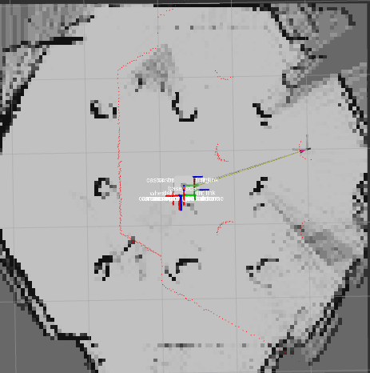
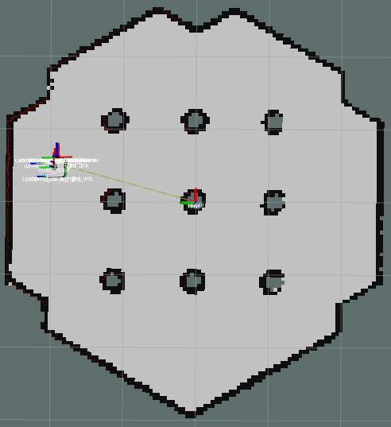

# **Offline Rao-Blackwellized Particle Filter SLAM Using Adaptive Sampling in ROS2**

---

## **Abstract**

This repository explores an **enhanced Rao-Blackwellized Particle Filter (RBPF) SLAM** algorithm addressing particle resampling inefficiencies. By incorporating **adaptive sampling** techniques (dynamic weight normalization and multi-resolution sampling), this SLAM framework is implemented in **ROS2 using C++** and tested on the **TurtleBot3** platform.  

Key contributions include:  
- Reducing particle weight variance to minimize depletion.  
- Efficient mapping with fewer particles.  
- Improved computational overhead and mapping accuracy.  

### **Key Highlights**
- **Platform**: ROS2, C++  
- **Hardware**: TurtleBot3 with LiDAR and wheel odometry  
- **Environment**: Indoor, realistic navigation challenges  

---

## **Introduction**

Simultaneous Localization and Mapping (**SLAM**) is crucial for enabling autonomous robots to navigate unknown environments.  
### **Challenges Addressed**:
1. Particle resampling inefficiencies in traditional RBPF SLAM.  
2. Computational constraints in real-time indoor navigation.  

### **Solution**:
We propose **adaptive sampling strategies**:  
- **Dynamic Weight Normalization**: Balances particle weights.  
- **Multi-Resolution Sampling**: Allocates particles based on uncertainty.  

Our methodology ensures accurate localization and mapping with reduced computational requirements.

---

## **Core Algorithm**

The SLAM problem is defined as:

$`p(x_{1:t}, m | z_{1:t}, u_{1:t}) \propto p(x_{1:t} | z_{1:t}, u_{1:t}) \cdot p(m | x_{1:t}, z_{1:t})`$

To minimize particle depletion:  
1. **Adaptive Thresholding** dynamically adjusts the resampling trigger based on particle weight variance.  
2. **Multi-Resolution Sampling** prioritizes high-uncertainty regions for particle allocation.  

---

## **Implementation**

### **Setup**  
1. **Hardware**: TurtleBot3 (LiDAR and wheel odometry)  
2. **Software**: ROS2, C++, Gazebo Simulation  
3. **Dependencies**:  
   - ROS2 Foxy or higher  
   - TurtleBot3 packages  
   - Gazebo (optional for simulation)  

---

### **Key Components**:
- **Particle Resampling**: Improved weight normalization minimizes outlier effects.  
- **Map Update**: Adaptive particle allocation for efficient grid-based mapping.  
- **Pose Estimation**: EKF-inspired correction enhances robustness.  

---

## **Experimental Setup**

### **Environment**  
- Narrow hallways  
- Multi-room spaces  
- Dynamic obstacles and occlusions  

### **Results**  
| Metric                 | Baseline RBPF SLAM | Proposed Method (Adaptive) |
|------------------------|--------------------|---------------------------|
| **Mapping Accuracy**   | Lower              | Higher                    |
| **Particle Utilization** | Inefficient        | Optimized                 |
| **Computational Cost** | High               | Reduced                   |

### **Visual Comparison**

Baseline RBPF SLAM:  
  

Proposed Method:  
  

---

## **How to Run**

### **1. Install Dependencies**
Follow ROS2 installation guidelines: [ROS2 Docs](https://docs.ros.org/).  

```bash
# Install TurtleBot3 and Gazebo dependencies
sudo apt update
sudo apt install ros-foxy-turtlebot3 ros-foxy-gazebo-ros-pkgs
```

### **2. Clone the Repository**
```bash
git clone https://github.com/your-repo/offline-rbpf-slam-adaptive.git
cd offline-rbpf-slam-adaptive
```

### **3. Build the Workspace**
```bash
colcon build
source install/setup.bash
```

### **4. Run the Algorithm**
For real TurtleBot3:  
```bash
ros2 launch offline_rbpf_slam adaptive_slam_launch.py
```

For Gazebo Simulation:  
```bash
ros2 launch offline_rbpf_slam adaptive_slam_gazebo.launch.py
```

---

## **Results**

Our approach achieves:  
1. **Improved Mapping Accuracy** with reduced particle count.  
2. **Reduced Computational Overhead** via adaptive resampling.  

---

## **Future Work**
1. Integration of **GTSAM** for nonlinear factor graph optimization.  
2. Testing on larger and more complex environments.  

---

## **References**

1. Grisetti, G., Stachniss, C., \& Burgard, W. (2005). *Improving Grid-based SLAM with Rao-Blackwellized Particle Filters by Adaptive Proposals and Selective Resampling*.  
2. Montemerlo, M., Thrun, S. (2003). *FastSLAM: A Factored Solution to the SLAM Problem*.  
3. OpenSLAM.org: GMapping Package.  
